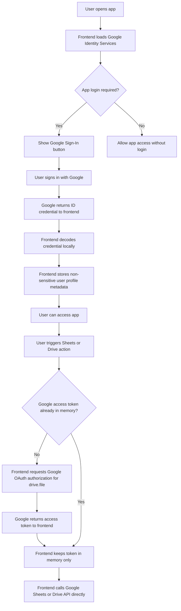
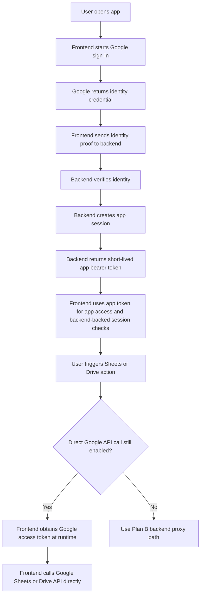
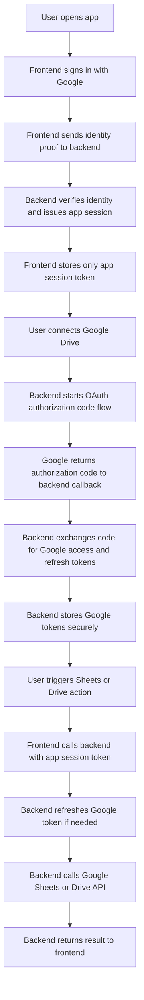

# ADR-20260501-2159: Introduce backend token broker for Google Sheets authorization

**Status:** Proposed
**Date:** 2026-05-01

---

## Context

The current frontend has two separate Google flows. First, the user signs in with Google so the app can identify the user and allow access to protected UI features. Later, when the user first performs a Sheets or Drive action, the frontend requests Google OAuth authorization for `drive.file` and keeps the returned Google access token only in browser memory. This works, but it creates a split user experience, keeps Google API authorization logic in the UI, and makes longer-lived, more controlled sessions difficult.

The next step is to simplify the UI-side workflow by introducing a backend token broker. The first phase will improve application session handling while keeping existing direct Sheets calls in the UI when needed. A later phase will move Sheets operations behind the backend so Google OAuth tokens can remain server-side.

---

## Decision

Adopt **Plan A** as the immediate architecture:

- Introduce a backend microservice responsible for application session management.
- Keep the current Google sign-in step in the frontend for user authentication.
- Exchange verified user identity with the backend for a short-lived application bearer token.
- Keep direct Google Sheets and Drive API calls in the UI temporarily for compatibility.
- Treat backend-proxied Sheets access as the planned follow-up (**Plan B**).

### Current flow

### Plan A: immediate target

### Plan B: planned follow-up

### Explicitly rejected for now

- Full immediate migration of all Sheets operations to the backend in the first step.
  This is more secure, but it increases delivery scope and changes too many surfaces at once.
- Keeping all authorization only in the frontend permanently.
  This preserves the current split flow and does not improve long-lived session handling.

---

## Implementation

### New files

| File | Description |
|------|-------------|
| `docs/adr/20260501-2159-backend-token-broker-for-google-sheets-authorization.md` | ADR for the backend token broker decision |
| `projects/backend/...` | Backend service files for auth exchange, session management, and follow-up proxy support |

### Modified files

| File | Change |
|------|--------|
| `.github/copilot-instructions.md` | Document the approved exception to the current browser-only constraint |
| `projects/frontend/src/app/core/auth/auth.service.ts` | Replace pure frontend-only auth flow with backend session exchange |
| `projects/frontend/src/app/core/google-api/google-api.service.ts` | Prepare compatibility path for direct Google calls and later backend proxy mode |
| `projects/frontend/src/environments/environment.model.ts` | Add backend auth/session configuration |
| `projects/backend/README.md` | Document backend runtime and deployment expectations |

---

## Usage

### User authentication in Plan A

1. User signs in with Google in the frontend.
2. Frontend sends the identity proof to the backend.
3. Backend verifies the identity and issues an application bearer token.
4. Frontend uses the application token for session-aware app access.

### Google Sheets authorization in Plan A

1. User enters the app with the backend-backed application session.
2. When a Sheets or Drive action is needed, the frontend may still request Google API authorization.
3. The frontend calls Google APIs directly until Plan B is implemented.

### Google Sheets authorization in Plan B

1. Frontend authenticates the user and obtains only the app session token.
2. Backend manages Google OAuth token exchange and refresh.
3. Frontend calls backend endpoints instead of Google APIs directly.

---

## Trade-offs

- Plan A improves application authentication and session control, but it does **not** fully remove Google access tokens from the browser as long as the UI still calls Google APIs directly.
- Plan A keeps migration risk lower by preserving the existing Sheets call path during the first step.
- Plan B is the target security model because it allows Google tokens to stay on the backend, but it requires moving Sheets operations behind backend APIs.
- Firestore adds a small baseline cost, but it simplifies revocation, refresh-token tracking, and session metadata management.
- The repository currently documents a browser-only architecture; this ADR must serve as the explicit decision record for introducing a backend service.